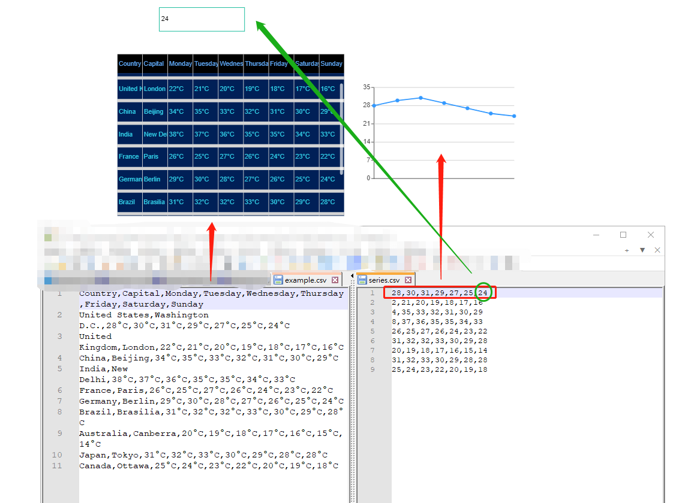

# SaaS-Composer-csv-data-server

This example shows how to use ***SimplaeJson*** plugin to read csv files.  

## Type Table  

The server read first csv row as Column Name. Other rows as table rows data.  

        Country,Capital,Monday,Tuesday,Wednesday,Thursday,Friday,Saturday,Sunday
        United States,Washington D.C.,28°C,30°C,31°C,29°C,27°C,25°C,24°C
        United Kingdom,London,22°C,21°C,20°C,19°C,18°C,17°C,16°C
        China,Beijing,34°C,35°C,33°C,32°C,31°C,30°C,29°C
        India,New Delhi,38°C,37°C,36°C,35°C,35°C,34°C,33°C
        France,Paris,26°C,25°C,27°C,26°C,24°C,23°C,22°C
        Germany,Berlin,29°C,30°C,28°C,27°C,26°C,25°C,24°C
        Brazil,Brasilia,31°C,32°C,32°C,33°C,30°C,29°C,28°C
        Australia,Canberra,20°C,19°C,18°C,17°C,16°C,15°C,14°C
        Japan,Tokyo,31°C,32°C,33°C,30°C,29°C,28°C,28°C
        Canada,Ottawa,25°C,24°C,23°C,22°C,20°C,19°C,18°C

## Type Timeseries  

Only read the first row as datapoints.  

## Response sample  

        [
            {
                "target": "series.csv",
                "type": "timeseries",
                "datapoints": [
                    [
                        "28",
                        0
                    ],
                    [
                        "30",
                        1
                    ],
                    [
                        "31",
                        2
                    ],
                    [
                        "29",
                        3
                    ],
                    [
                        "27",
                        4
                    ],
                    [
                        "25",
                        5
                    ],
                    [
                        "24\r",
                        6
                    ]
                ]
            },
            {
                "target": "example.csv",
                "type": "table",
                "columns": [
                    {
                        "text": "Country"
                    },
                    {
                        "text": "Capital"
                    },
                    {
                        "text": "Monday"
                    },
                    {
                        "text": "Tuesday"
                    },
                    {
                        "text": "Wednesday"
                    },
                    {
                        "text": "Thursday"
                    },
                    {
                        "text": "Friday"
                    },
                    {
                        "text": "Saturday"
                    },
                    {
                        "text": "Sunday\r"
                    }
                ],
                "rows": [
                    [
                        "United States",
                        "Washington D.C.",
                        "28°C",
                        "30°C",
                        "31°C",
                        "29°C",
                        "27°C",
                        "25°C",
                        "24°C\r"
                    ],
                    [
                        "United Kingdom",
                        "London",
                        "22°C",
                        "21°C",
                        "20°C",
                        "19°C",
                        "18°C",
                        "17°C",
                        "16°C\r"
                    ],
                    [
                        "China",
                        "Beijing",
                        "34°C",
                        "35°C",
                        "33°C",
                        "32°C",
                        "31°C",
                        "30°C",
                        "29°C\r"
                    ],
                    [
                        "India",
                        "New Delhi",
                        "38°C",
                        "37°C",
                        "36°C",
                        "35°C",
                        "35°C",
                        "34°C",
                        "33°C\r"
                    ],
                    [
                        "France",
                        "Paris",
                        "26°C",
                        "25°C",
                        "27°C",
                        "26°C",
                        "24°C",
                        "23°C",
                        "22°C\r"
                    ],
                    [
                        "Germany",
                        "Berlin",
                        "29°C",
                        "30°C",
                        "28°C",
                        "27°C",
                        "26°C",
                        "25°C",
                        "24°C\r"
                    ],
                    [
                        "Brazil",
                        "Brasilia",
                        "31°C",
                        "32°C",
                        "32°C",
                        "33°C",
                        "30°C",
                        "29°C",
                        "28°C\r"
                    ],
                    [
                        "Australia",
                        "Canberra",
                        "20°C",
                        "19°C",
                        "18°C",
                        "17°C",
                        "16°C",
                        "15°C",
                        "14°C\r"
                    ],
                    [
                        "Japan",
                        "Tokyo",
                        "31°C",
                        "32°C",
                        "33°C",
                        "30°C",
                        "29°C",
                        "28°C",
                        "28°C\r"
                    ],
                    [
                        "Canada",
                        "Ottawa",
                        "25°C",
                        "24°C",
                        "23°C",
                        "22°C",
                        "20°C",
                        "19°C",
                        "18°C"
                    ]
                ]
            }
        ]